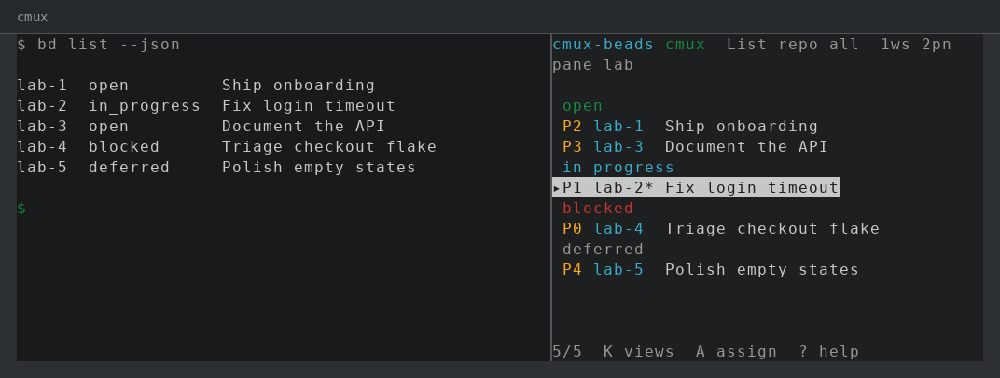
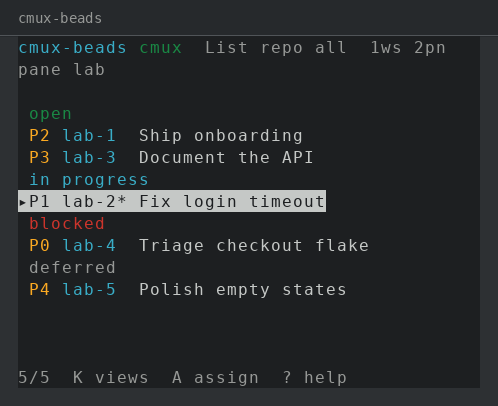
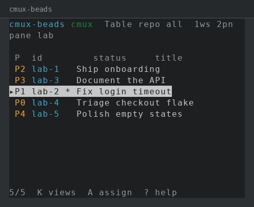
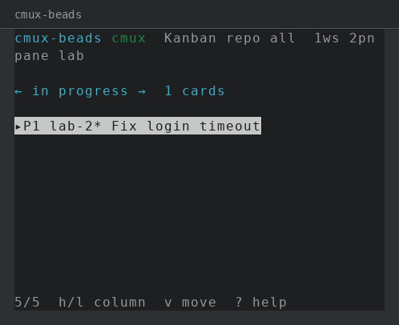

# cmux-beads



[](https://github.com/RaviTharuma/cmux-beads/releases/latest)

```sh
cmux sidebar plugin install https://github.com/RaviTharuma/cmux-beads.git
cmux sidebar plugin use cmux-beads
cmux sidebar plugin update cmux-beads
```

A [Beads](https://github.com/steveyegge/beads) (`bd`) board for the [cmux](https://github.com/manaflow-ai/cmux) right sidebar. Cards are `bd` issues, columns are `bd` statuses, and every write is a `bd` argv call. The board never invents its own store.

Requires **`bd` v0.60+** on `PATH`.

## Sidebar plugin contract

A cmux sidebar plugin is an ordinary TUI. cmux runs it inside a PTY sized to the sidebar and renders that PTY with the same Ghostty VT pipeline as pane surfaces. `TERM` is the host TERM; this plugin uses named ANSI colors and reverse/dim so Ghostty themes the cells. It does not ship a private RGB palette.

cmux exposes the session control socket as `CMUX_TUI_SOCKET` (legacy `CMUX_MUX_SOCKET`). Live workspaces, screens, and panes come from `list-workspaces` on that socket. `process-info` on the focused pane's active tab supplies `cwd` for `bd`.

Mouse input is not forwarded to sidebar plugins. There is no drag-and-drop. Kanban moves are keys (`v` then `h`/`l`). `Esc` never quits; cmux owns the prefix chord (`prefix-S` focuses the sidebar).

See [manaflow-ai/cmux-sidebar-fzf](https://github.com/manaflow-ai/cmux-sidebar-fzf) for the reference plugin this follows.

## Views

Three views, one keystroke apart (`K` / `Tab`):

| List | Table | Kanban |
| --- | --- | --- |
|  |  |  |

Narrow sidebars show one kanban column at a time (`h`/`l`).

## Assign to a live pane

`bd` has no pane id. Assignment is stored on the issue as `cmux:{workspace_id}/{pane_id}` from the live tree. Press `A` to pick a running workspace/screen/pane. The header marks assigned beads with `*`.

## Keys

| Key | Action |
| --- | --- |
| `K` / `Tab` | cycle List / Table / Kanban |
| `j` `k` / arrows | move selection |
| `h` `l` | kanban: change column |
| `v` | move mode: `h`/`l` writes `bd update -s` |
| `Enter` | detail (`bd show --json`) |
| `c` | claim (`bd update --claim`) |
| `x` | close (`bd close -r`, reason required) |
| `a` / `e` | create / edit |
| `A` | assign to a live cmux pane |
| `/` | filter. `Esc` clears |
| `r` | refresh from `bd` |
| `?` | help |
| `q` / `Ctrl-C` | quit |
| `Esc` | back out a layer — never quits |

## Standalone development

```sh
CMUX_TUI_SOCKET=/path/to/cmux-tui.sock cargo run
cargo run -- --cwd /path/to/a/repo/with/.beads
cargo run -- --selftest --cwd /path/to/a/repo/with/.beads
```

Without a socket the plugin uses the process working directory and labels itself `solo`. Assign-to-pane needs a live socket.

## Manifest

```toml
[plugin]
name = "cmux-beads"
kind = "sidebar"
version = "0.1.0"
description = "Beads (bd) board for the cmux right sidebar: list, table, kanban"

[run]
command = ["target/release/cmux-beads"]

[build]
command = ["cargo", "build", "--release"]
```

Install clones to `~/.local/share/cmux/mux-plugins/cmux-beads` (or `$XDG_DATA_HOME/cmux/mux-plugins/cmux-beads`), runs `cargo build --release`, and records the binary in the cmux-tui config.

## Test

```sh
cargo fmt --check
cargo clippy --all-targets -- --deny warnings
cargo test
cargo build --release
```

## License

[MIT](LICENSE). See [CHANGELOG](CHANGELOG.md).
